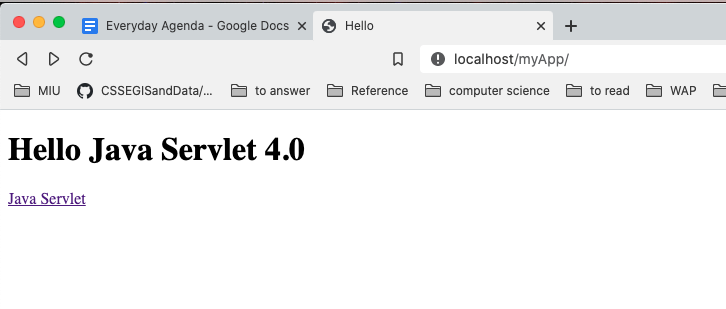
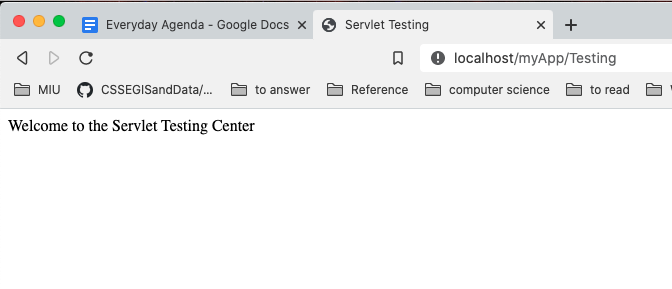

#### How to run:

`docker-compose up`

I hate using IDEs to do builds. I want to be able to run Tomcat using only Docker and command line. I found there are very little learning materials to do that, so I started doing it myself. Its not a new thing but very rare. But I like this appraoch better. This helps in understanding each and every line of what's happening where.

#### Output:
##### Welcome page

##### Java Servlet

